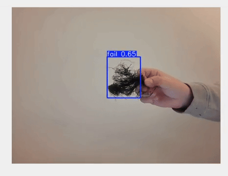
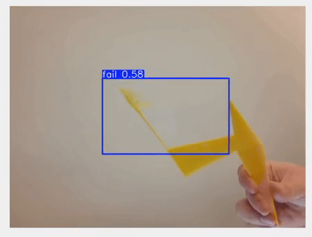

# YOLO Multi-Camera Live Detection & Printer Control

This project is a **Python Tkinter application** that allows you to monitor multiple camera feeds with **YOLO object detection overlay**, while also integrating **3D printer control** functionality. It is designed for real-time monitoring and quick response in environments such as workshops or labs.

---

## Features

- **Multiple Camera Support**: Dynamically open multiple camera feeds in separate tabs.
- **YOLO Detection Overlay**: Live object detection using a pre-trained YOLO model (`best.pt`). Detected objects are highlighted with bounding boxes.
- **Confidence Monitoring**: Maximum detection confidence per frame is displayed. If the confidence exceeds 85%, a status icon turns red.
- **Printer Integration**: Assign a specific printer to each camera. Each tab provides a **Terminate Print** button to remotely stop a print job via API.
- **Real-time Dashboard**: Left-side panel shows controls, confidence, and status indicator; camera feed is centered and resized to a fixed window size for smooth display.
- **Minimal Jitter**: Uses `tk.Canvas` for video feed to reduce flickering and jitter during motion.

---

## Installation

### 1. Clone the Repository

```bash
git clone <your-repo-url>
cd <repo-directory>
```
## 2. Install Dependencies

```bash
pip install ultralytics opencv-python pillow requests
```

## Usage

Run the application with the number of connected cameras:

```bash
python app.py <camera_count>
```
Example:
```bash
python application.py 2
```


### Demo 1



*Shows live detection on a single camera feed.*

### Demo 2



*Shows live detection on a single camera feed.*

